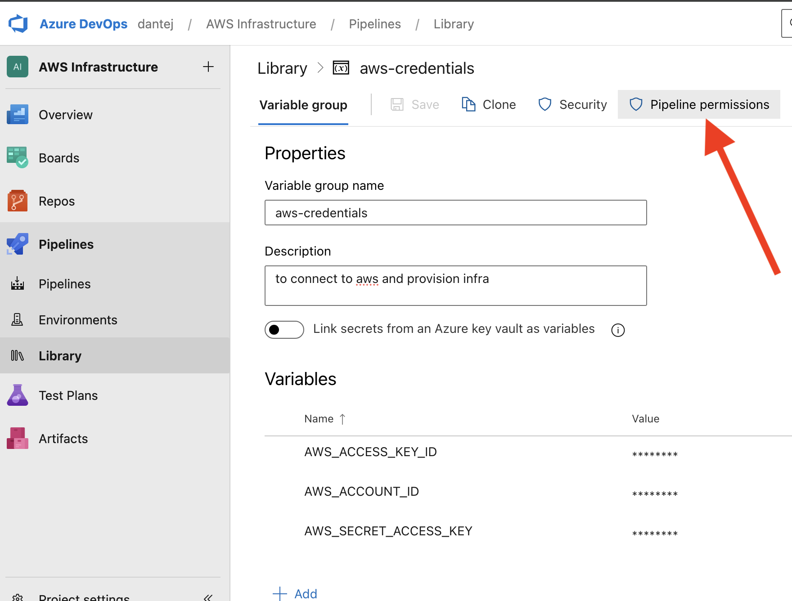

# Python part
In the python module we generate the zip file for AWS Lambda that includes the needed pip packages and the latest python code. Also later we will focus in use container images instead for zip files.

For Zip file Lambda version:
first create `venv`:
```
cd python
python3 -m venv venv
source venv/bin/activate
```

Once activated the venv, install dependencies from requirements.txt inside your venv:
`pip install -r requirements.txt`


Later, locate yourself in the folder `/python` and package all the dependencies from there, and zip it (the zip file we move it inside the Terraform folder, in order to later can be taken to create the infrestructure):
```
pip install --target package_to_zip -r requirements.txt
cp index.py package_to_zip/
cd package_to_zip
zip -r ../../terraform/lambda.zip .
cd ..
```

## Creating Python image with ECR
Following this AWS official guide: https://docs.aws.amazon.com/lambda/latest/dg/python-image.html
First go to the "python" folder, and because I use M1 Mac (ARM64) I build the image using:
```
docker buildx build --platform linux/amd64 -t python/omdb:V1.0 .
```
Or in case you use Linux:
```
docker build -t python/omdb:v1.0 .
```

Later Tag the image and push it to AWS:
```
docker tag python/omdb:V1.0 <AWS-ECR-URL>:V1.0

docker push <AWS-ECR-URL>:V1.0
```


# Terraform Setup part
## Setting up S3 Backend to store and centralize the tfstate file
First you have to create your S3 bucket Backend:
```
aws s3 mb s3://my-terraform-state-${RANDOM} --region eu-central-1 
```
and then enabling Versioning to this S3:

```
aws s3api put-bucket-versioning --bucket <YOUR-BUCKET-NAME> --versioning-configuration Status=Enabled
```

Verify if s3 versioning is now enabled:
```
aws s3api get-bucket-versioning --bucket <YOUR-BUCKET-NAME>
```

Now that is created the S3 Bucket, now change your backend.tf with its correct bucket name!


## Running Terraform from Local Machine
Start with Terraform Init selecting the S3 Backend bucket:
```
terraform init -backend-config="bucket=<YOUR-BUCKET-NAME>" \
               -backend-config="region=eu-central-1"
```

Once is connected with the S3 Backend, run the other terraform commands:
```
terraform plan
terraform apply
```

# Pipeline Setup part

## GithubActions Pipeline
### Running Terraform from GithubActions Pipeline
It consist in `ci.yaml` and `cd.yaml`.
As already configured in the CD.yaml, the terraform init Job is configured using CICD env variables:
```
terraform init -backend-config="bucket=${{ env.TF_S3_BUCKET_BACKEND_NAME }}" \
                     -backend-config="region=${{ env.AWS_REGION }}"
```


## AzureDevOps Pipeline
### Setting up AzureDevOps Pipeline
First, inside AzureDevOps, you have to install in your Organization Settings the Extension called `AWS Toolkit for Azure DevOps`.

Second, in your Project Settings of AzureDevOps, you have to create a new `Service Connection`, in order AzureDevOps & AWS can communicate. For that, as a pre-requisite, you will need to create a new `User` in AWS Portal, `attaching the Policies` you will need, and from that new User you have to generate its `Access Key ID` & `Secret Access Key` in the `Security Credentials Tab`, because this will be asked when you want to create the new `Service Connection`. 
For more details, I followed this guide: https://dev.to/aws-builders/provisioning-infrastructure-on-aws-using-azure-devops-3g75


### Adding Secrets in AzureDevOps Pipeline
In azure devops, to add Secrets you will use during the pipeline is running like AWS credentials, inside AzurePipelines, you use its option `Library` and create a new `Variable Group`. After storing your respective secrets, you "Save" and later click in `Pipeline Permissions`, there will be a "3 Dots" which contains the option `Open Access` that will make usable those secrets to all the pipelines (in case this is what you want). For more details please check the screenshot below:


So at the end, you have to add 3 secret in the variables group: `AWS_ACCESS_KEY_ID` , `AWS_ACCOUNT_ID` , `AWS_SECRET_ACCESS_KEY`.


### Running Terraform from AzureDevOps Pipeline


# Testing deployed Lambda
To test the API CALL, use this URL structure: https://`<AWS-URL>`?apikey=`<APIKEY>`&t=titanic


=======


# Terraform Modules Part
## DynamoDB Module

In this project, I am using both hash_key (Partition Key) and range_key (Sort Key), where it will be assigned to the following attributes in my DynamoDB Table:

- hash_key = `name` attribute (column)
- range_key = `favorite_movie` attribute (column)
- and `age` as normal attribute

This means each `name` can store multiple favorite movies:

| Name  | Favorite Movie |
|-------|--------------|
| Alice | Titanic     |
| Alice | Inception   |
| Bob   | Avatar      |

BUT, If Only Using hash_key (Partition Key) means:  each `name` cannot store multiple favorite movies!

